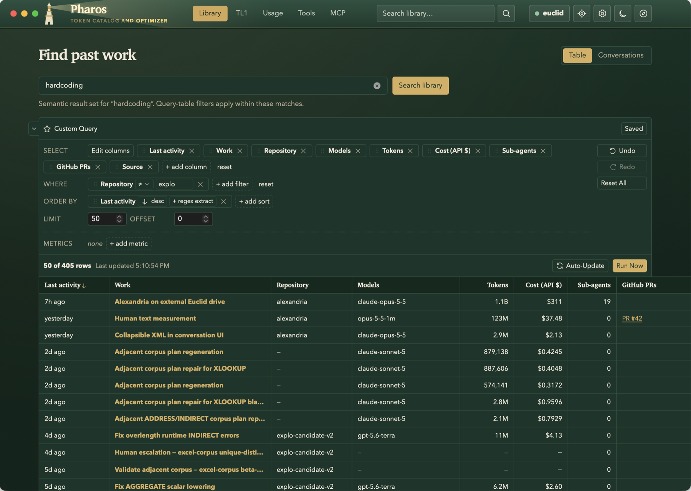
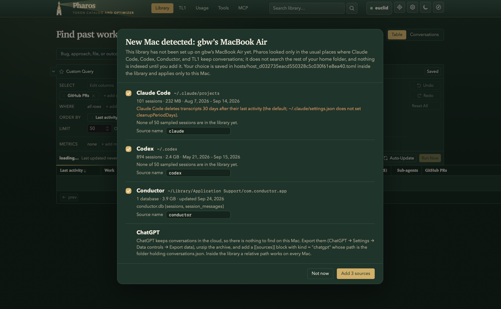
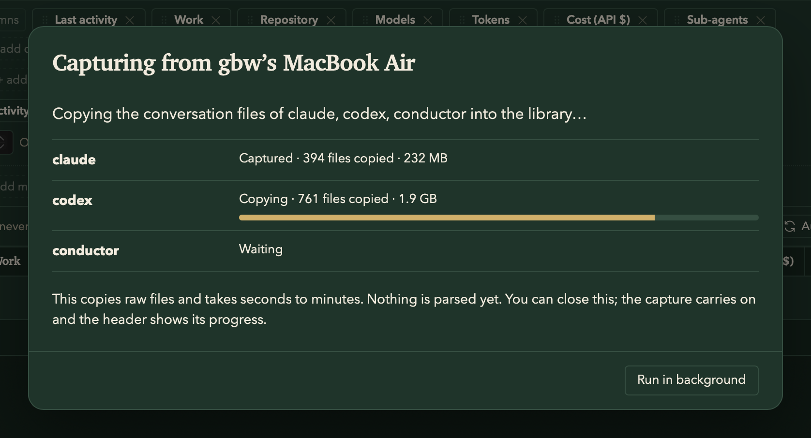
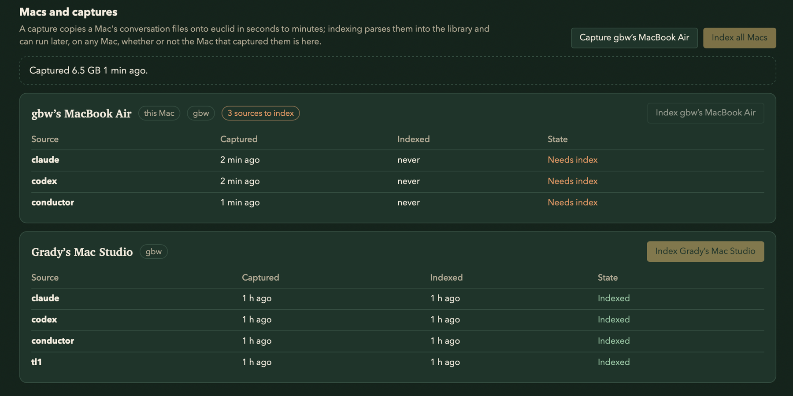
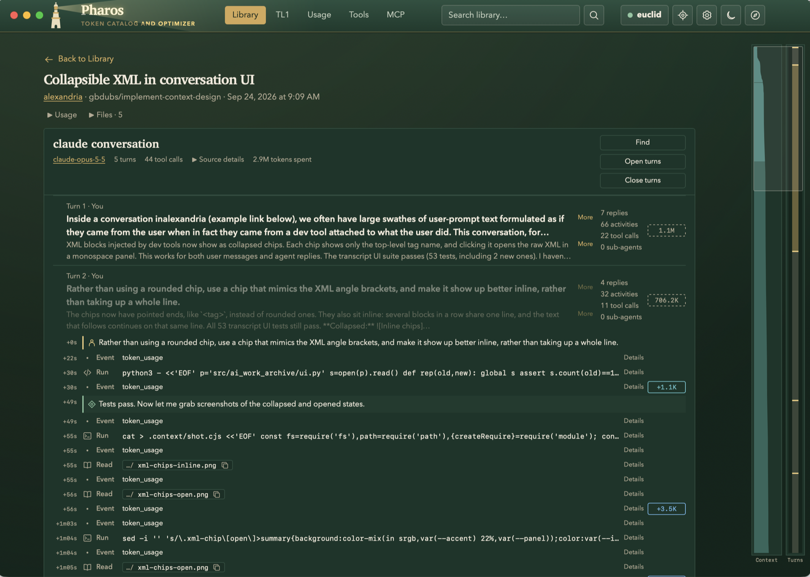
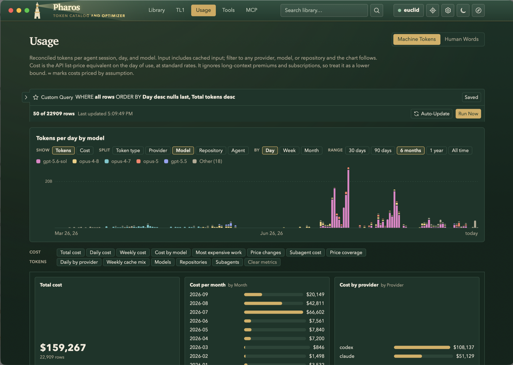
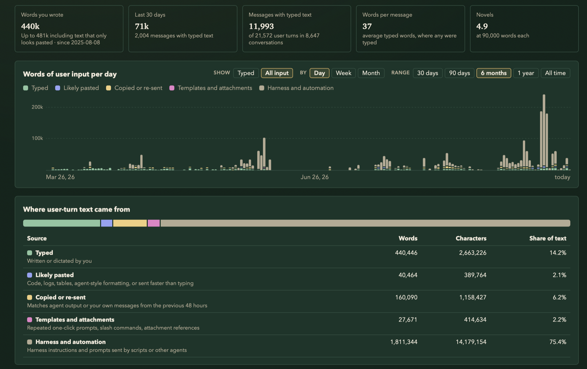
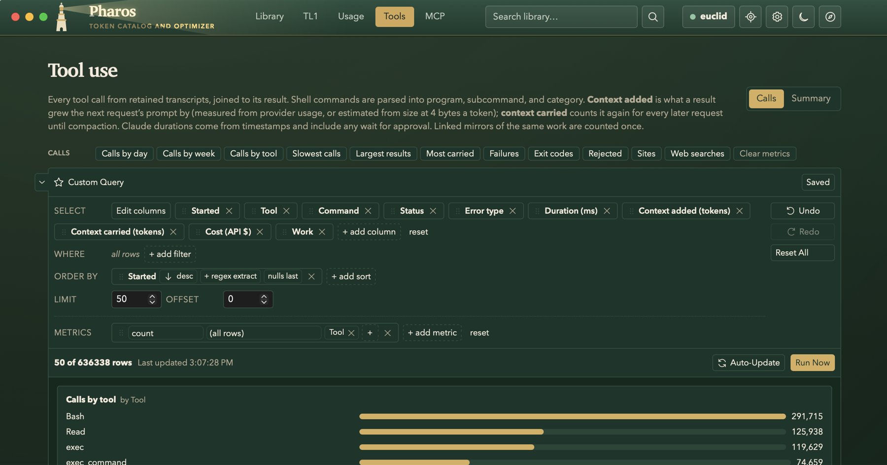
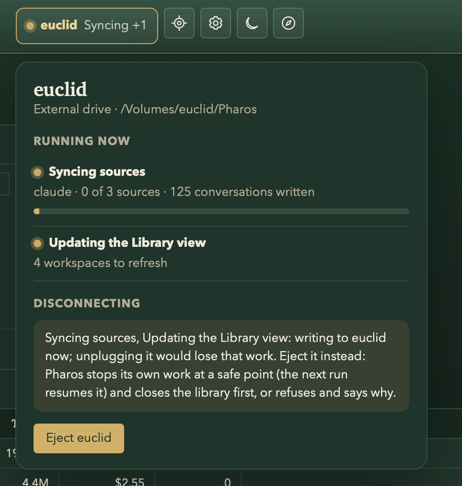

<p align="center">
  
</p>

<h1 align="center">Pharos</h1>

<p align="center">
  <strong>A token catalog and optimizer for everything you've done with coding agents.</strong>
</p>

<p align="center">
  <a href="https://grady.dev/projects/pharos">Blog post</a> ·
  <a href="#getting-started">Getting started</a> ·
  <a href="#make-it-yours">Make it yours</a> ·
  <a href="docs/technical-overview.md">Technical overview</a> ·
  <a href="#contact">Contact</a>
</p>

<p align="center">
  
  
  <a href="LICENSE"></a>
</p>

---

Pharos gathers your conversations with Claude Code, Codex, Conductor, and ChatGPT
exports into one searchable library on your Mac, or on an external drive that
moves between Macs. You can search past work by what you were trying to do, see
what each piece of work cost in tokens and dollars, find which tools and
commands your agents spend their context on, and give your agents read-only
access to the whole history over MCP. Nothing leaves your machine: every source
is read-only, and the service only listens on loopback.

For the story of why I built it and what I learned from my own numbers, read the
blog post: **[grady.dev/projects/pharos](https://grady.dev/projects/pharos)**.



## Getting started

### Requirements

- macOS 14 or later

Once a release is published, download the prebuilt universal app from
[GitHub Releases](https://github.com/gbdubs/alexandria/releases). See
[releases and updates](docs/releases-and-updates.md) to install it as a portable
library without building from source.

To build from source, you also need:

- [Go](https://go.dev/dl/). `go.mod` pins Go 1.26, and an older `go` downloads it automatically.
- Xcode Command Line Tools (`xcode-select --install`) for the Swift wrapper
- Node.js and npm (optional; without them the checked-in frontend bundle is used)

### 1. Build a library

Pharos works best as a *library*: one folder that holds the app, its
configuration, and everything it indexes. Put it on an external drive to carry
your history between Macs, or anywhere you like on a single Mac.

```sh
git clone https://github.com/gbdubs/alexandria.git pharos
cd pharos
macos/install-library.sh /Volumes/<your-drive>/Pharos
open /Volumes/<your-drive>/Pharos/Pharos.app
```

Rerunning `install-library.sh` later upgrades the app and leaves your
configuration and catalog alone.

> Prefer a plain per-user install? `./launch.sh` builds and opens Pharos with
> its configuration in `~/Library/Application Support/AI Work Archive/archive.toml`.
> In that mode you add sources to `archive.toml` by hand; `alexandria probe` lists
> what it finds. See [Configuration](docs/configuration.md).

### 2. Choose your sources

The first time you open the library on a Mac, Pharos checks the handful of
places where Claude Code, Codex, and Conductor keep their conversations. It
never scans the rest of your home folder. It shows what it found: how many
sessions, how far back they go, and a warning when a tool is set to delete old
transcripts. Nothing is indexed until you pick.



ChatGPT keeps conversations in the cloud, so export your data from ChatGPT and
point a source at the folder holding `conversations.json`.

### 3. Capture and index

Pharos first *captures* your conversation files by copying them, unparsed, into
the library, which takes seconds to minutes. Then it *indexes* them into a
searchable catalog. You can close the dialog and both steps keep running in the
background.



Indexing can happen later, on any Mac. **Settings → Sources → Macs and
captures** shows every Mac in the library and what still needs indexing.



On another Mac, plug in the drive and double-click **Add This Mac.command**
beside the app, or just open the app and accept the panel again.

### 4. Find past work

The **Library** search has three modes: conversation text, modified files, and
URLs used by tool calls. Text results group user messages, agent responses, and
retained thinking by conversation, with a link to the matching message. Put a
phrase in quotes for an exact phrase match. Fuzzy words are on by default;
case-sensitive and literal-separator matching are optional. Text search uses
the message index directly and does not rank workspaces with vectors. File
results name a conversation when the archived evidence supports that link;
otherwise they identify the workspace. URL results exclude links merely
returned by web search.

With an empty search, the Library table remains a query builder: pick columns,
filter (including OR and NOT), sort on several keys, add metrics, and save views.

Open a row to see its changed files, linked PRs, and conversations. Each
conversation reads turn by turn: your prompt, the outcome, and every command,
file read, and tool call in between, marked with how many tokens it added to the
context. The rail on the right tracks context size and turns across the whole
conversation, and you can click it to jump to any point.



### 5. See where the tokens go

**Usage → Machine Tokens** breaks down tokens and API-equivalent cost by day,
model, provider, repository, and agent. Costs use list prices on the day of use,
so treat them as a lower bound.



**Usage → Human Words** estimates how much you actually typed, as opposed to
pasted, re-sent, or harness-injected text.



**Usage → Carbon Impact** estimates the electricity and CO₂e behind your token
usage. Compare all time with the last 30 days and adjust the grid, data center
overhead, and energy assumptions.

**Tools** joins every tool call to its result. It shows which calls fail, which
are slow, and which results bloat the context window for the rest of the session.



### 6. Connect your agents (optional)

The **MCP** tab gives you a copyable stdio configuration for your agent client.
Your agents can then search and read past conversations. The tools are
read-only, and one switch turns them off for every client.

### 7. Unplug safely

The drive badge in the header shows what Pharos is doing with the library right
now. Use its **Eject** button instead of pulling the drive: Pharos stops its own
work at a safe point, closes the library, and then ejects, or tells you why it
can't.

<p align="center">
  
</p>

For everything else (the CLI, the HTTP API, configuration keys, code signing,
backups, and development), see the [technical overview](docs/technical-overview.md)
and [configuration reference](docs/configuration.md).

## Make it yours

Pharos is built around one person's workflow: the agents I use, the questions
I ask about my own work, and the way I move between Macs. Your setup is
different, so **please fork it** and bend it to fit. Some starting points:

- **Add a source.** Adapters live in `internal/archive/adapters.go`,
  `adapter_conductor.go`, and `adapter_exports.go`, and the places Pharos looks
  on a new Mac are in `internal/archive/probe.go`. The [canonical export
  format](docs/canonical-export.md) is the easiest way to bring in anything else.
- **Ask different questions.** The queryable fields for every table are defined
  in [`schemas/`](schemas). The same files drive the React UI in `web/src` and
  the Go query executor.
- **Fix the prices.** Model prices live in `pricing/cost_changes.json`. See
  [`pricing/README.md`](pricing/README.md).

### A note on TL1

You'll find code here that refers to a project called **TL1**: the `tl1` and
`tl1-export` source kinds, the TL1 tab, `internal/archive/tl1_*.go`,
`web/src/tl1.tsx`, and the mothballed workspace-reclamation contract in
[`docs/tl1-contract.md`](docs/tl1-contract.md). TL1 is a private agent
orchestration tool I use, and it isn't publicly available. That code is
customized for my use cases. Pharos works without it: with no TL1 source
configured, the TL1 tab stays hidden. Delete it from your fork, or use it as a
template for integrating your own tools.

A few internal names also predate the name Pharos. The CLI is still called
`alexandria`, and configuration lives under `AI Work Archive`, so existing
installs keep working.

## Contact

Found a bug, or have an idea for an addition? **[Open an issue](https://github.com/gbdubs/alexandria/issues)**.
I'm happy to discuss new sources, new analyses, or anything you've built on a
fork. You can also find me at [grady.dev](https://grady.dev).

## License

[MIT](LICENSE) © 2026 Grady Berry Ward
